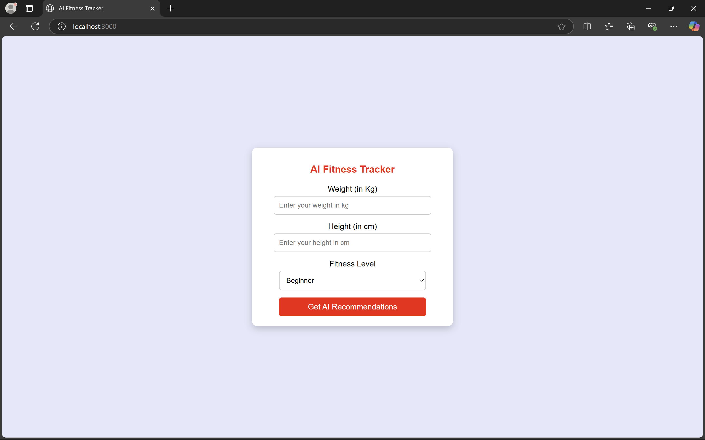

# AI Fitness Tracker Web Application

A web-based fitness tracker that generates personalized calorie intake and workout recommendations using OpenAI’s GPT model. Includes a user-friendly interface for inputting weight, height, and fitness level.

## Features
- Designed and implemented a fully responsive web application using **HTML**, **CSS**, and **JavaScript**.
- Integrated OpenAI API for generating dynamic fitness plans based on user inputs.
- Built a Node.js backend with Express to handle API requests and ensure secure data handling.

## Technologies Used
- **HTML**
- **CSS**
- **JavaScript**
- **Node.js**
- **Express.js**
- **OpenAI API**

## How to Run
1. Clone this repository:
   ```bash
   git clone <[repository-url](https://github.com/Shivani-Toorpu/AI-Powered-Fitness-Guide.git)>
   ```
2. Navigate to the project directory:
   ```bash
   cd <project-folder>
   ```
3. Install dependencies using:
   ```bash
   npm install
   ```
4. Add your OpenAI API key in a `.env` file:
   ```plaintext
   OPENAI_API_KEY=your_api_key_here
   ```
5. Start the server:
   ```bash
   node app.js
   ```
6. Open your browser and navigate to:
   ```
   http://localhost:3000
   ```

## Screenshots



## License
This project is open-source and available under the MIT License.
